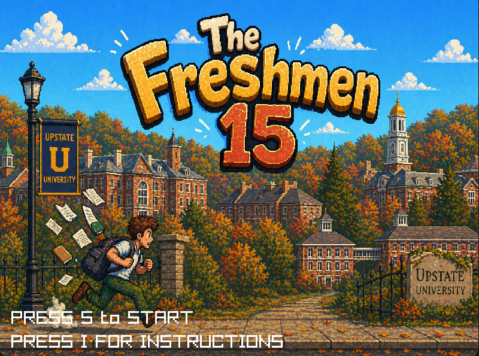
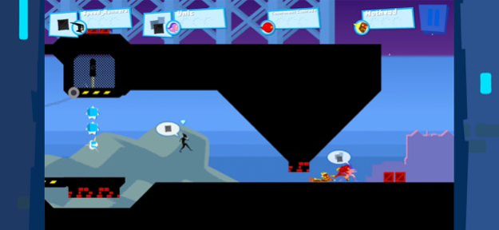
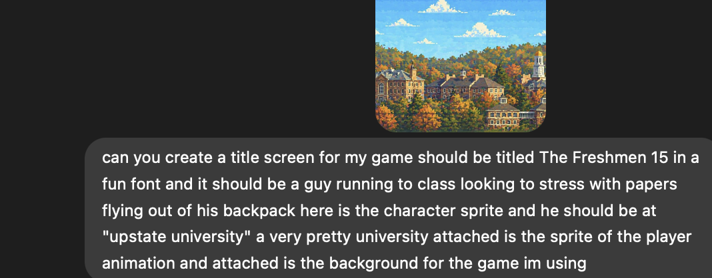

# THE FRESHMEN 15: GAME DESIGN DOCUMENT

# AUTHOR: JAAN BROOKS 

## Table of Contents

- [Introduction](#introduction)
  - [Game Summary](#game-summary)
  - [Inspiration](#inspiration)
    - [Personal Inspiration](#personal-inspiration)
    - [Gameplay inspiration](#gameplay-inspiration)
  - [Player experience](#player-experience)
  - [Platform](#platform)
  - [Software](#software)
  - [Genre](#genre)
  - [Target Audience](#target-audience)
- [Concept](#concept)
  - [Gameplay overview and experience](#gameplay-overview-and-experience)
  - [Setting and theme interpretation](#setting-and-theme-interpretation)
  - [Game Narrative analysis (Action and Enigm)](#game-narrative-analysis-action-and-enigm)
    - [Action code](#action-code)
    - [Enigma code](#enigma-code)
  - [Game mechanics](#game-mechanics)
    - [First level and primary mechanics](#first-level-and-primary-mechanics)
    - [Second Level Mechanics](#second-level-mechanics)
  - [Level progression](#level-progression)
  - [Controls](#controls)
- [Technical Walkthrough Section](#technical-walkthrough-section)
  - [Mechanic One: Wall Sliding and Jumping](#mechanic-one-wall-sliding-and-jumping)
  - [Mechanic 2: Freshmen 15 Meter](#mechanic-2-freshmen-15-meter)
- [Art Implementation](#art-implementation)
- [Project Time Estimation and Distribution](#project-time-estimation-and-distribution)
- [Credits and References](#credits-and-references)
- [AI Intervention](#ai-intervention)
- [Classmate contribution](#classmate-contribution)
- [Video Demo](#video-demo)

## INTRODUCTION
### Game Summary: 
The average Colgate student remembers fondly the moment they opened their acceptance letter. For many of us who's dream school was Colgate, seeing that you were accepted ushered in intense emotions of excitement and joy. 

However, in the coming months, many of us would learn that while college would be the time of our lives, it would also bring with it new levels of stress associated with deadlines, responsibilities, and generally balancing work with play. 

THE FRESHMEN 15 is a speedrunning type game that encapsulates these mixed emotions and experiences. Fun is to be had with the platforming and interactions you have along the way, but you must balance this with tending to your collegiate responsibilites (getting to the checkpoint on time). If you've ever struggled with time management, responsibilites, work life balance, and of course the ubiquitous [Freshmen 15](https://en.wikipedia.org/wiki/Freshman_15) then this game will resonate with you. If unfamiliar with the term freshmen 15 click the link on "Freshmen 15" to read more its quite funny.

___ 

 ### Inspiration: 

 #### Personal Inspiration
I wanted to make a game for which the average college student and alumni could relate to, and I plan on doing this through a game which exemplifies and embodies the stresses of Freshmen year. As someone who has stressed about grades, making sure I get to my scheduled events on time, and also taking care of my health, I really wanted to incorporate these challenges into my game. 

#### Gameplay inspiration:
Speedrunners is a video game which me and my friends in my townhouse have been playing almost daily for weeks now. It is a local couch co-op game where the objective is to outrun your opponents on a cyclical map. You gain advantages via performing the correct platforming mechanic at the right time (ex. sliding underneath a block to access a quicker path). This creates a very engaging game where unlike most platformers where it doesn't really matter how you get to the end as long as you make it there, Speedrunners emphasizes attention to detail and trying to maximize your route. One could make the argument this relates to college, where it's not just about graduation, it's about maximizing your experience along the way which is why I think thematically it is a great source of inspiration. Gameplay wise it is also incredibly addicting and satisfying to perfect your route which is something I think would be so cool to emulate. My game specifically borrows the mechanics of: **COLLECTIBLE AND BANKABLE SPEED BOOSTS (can save for later), WALL JUMPING, SLIDING,  and VARIABLE PATHS TO THE SAME DESTINATION**

### Player experience: 
In two levels at Upstate University, the player controls "Timmy" an 18 year old college student who is assigned various deadlines which he must meet by reaching a certain location in a certain amount of time. The player traverses platforming sections emphasizing speed and precision, with an emphasis on avoiding things that will slow him down. It is a difficult game by nature that will require mastery and practice as failure means restarting the level from scratch.

### Platform
The game is developed to be released on Mac and Windows.

### Software:
Pyray and python for programming. 

ChatGPT sprite generation.  
 
Preview for sprite manipulation.  
  
  Quick Time player for sound editing (just cutting length of sound effects)

### Genre
Single Player, Speedrunning platformer

### Target Audience
Colleged age or collegiate alums who understand the emotions the game is trying to convey. Additionally, precise platforming and time limits per level require **intermediate** platforming skills.

## Concept
### Gameplay overview and experience:
Hero: Meet 18 year old college freshmen Timmy. He is excited for the upcoming year, but is also a little anxious about keeping up with his responsibilities. The player controls Timmy and they must use the following: sliding to navigate under half tiles, variable jump height to precisely land jumps, wall sliding to time when to Wall jump, bankable coffee speed boosts to increase speed on flat surfaces and lunge across gaps that would be otherwise impossible to cross, all to get to the endpoint on time. ___Additional mechanics are implemented to mimic experiences in college life. Ever been caught up in a conversation with an acquaintance that seems to go on to long, well that can happen in the game with running into yappers who lock your movement for a bit while they yap. Ever struggled with "Freshmen 15"? You gain weight by running into beers which makes your player take longer to move. Ever abused caffeine to reach a deadline, you can do the same with coffee boosts in game. Overall the game incorporates mechanics inspired by the college experience.___

### Setting and theme interpretation: 
The Freshmen 15 takes place in Upstate University. Modeled after Colgate University, the (background is literally a pixelated version of the campus), the setting is elegant. The tiles were generated with the prompt of needing to have elegant stone to match the elegancy of Colgate. This creates a juxtaposition, thematically of being in a beautiful place yet still facing stress from impending deadlines. Transition frames add to this alternating between exciting news like you've been accepted emails, to get to the Registration office and officially accept on time or your offer will be rescinded, and also a montage of the player having fun, partying, playing spikeball but then also taking a midterm. Not to reiterate ad nauseum, but I'm trying to build that contradiction of the best and also most stressful time of your life.

### Game Narrative analysis (Action and Enigm):

#### Action code: 
The game starts off with Timmy receiving his acceptance to upstate university. It will have been his dream school and as an audience we can resonate with the passion and anxiety that comes with receiving a life altering opportunity. 

#### Enigma code: 
The subject is of course timmy's academic journey. The mystery of course is whether or not he will be able to pass freshmen fall. To incorporate a delay stage, it is crucial timmy "fails" his first test. Imbetween the first and second level timmy takes a midterm and learns that he fails it in an email. The audience thinks, does timmy really have what it takes. For the "jamming" portion, Timmy must attend office hours and submit his retake to see if he will pass the now pass#. The engima will finally be solved when upon successfully making it to say to the end of the second level to hand in his test retake and the professor grades it and he passes.

### Game mechanics:
#### First level and primary mechanics:  

| Mechanic | Description |
| --- | --- |
| **Variable Jump Height** | Tapping the spacebar will cause a jump, holding it longer will make you jump higher |
| **Player Slide** | Pressing S will initiate a slide that allows the player to slide under half tiles to access new paths |
| **Wall Sliding** | Jumping into a wall and holding the A or D depending where the wall is will lock you into the wall and you will fall slower down it. Useful for timing wall jumps |
| **Wall Jump** | Allows player to jump off of a wall with different physics than a normal jump, also locks out player left right input for a bit for proper feeling and control |
| **Bankable coffee speed boost** | Collecting a coffee will allow the player to increase horizontal movement speed by a lot by pressing shift. Lasts a short duration and the player can bank up to two coffees at a time. 
| **Time meter** | Player will lose level if they run out of time and will have to restart from the beginning |

#### Second Level Mechanics

| Mechanic | Description |
| --- | --- |
| **Freshmen 15 Meter** | Collecting beers will increase your Freshmen 15 meter, making movement take longer (Timer runs out quicker)|
| **Yappers** | Avoid yappers as they will lock player movement for a few seconds whilst yapping nonsense to you and therefore waste time | 

### Level progression:
#### 1st level. 
Receive your acceptance letter that is contingent upon you getting to the registration office on time to accept. Basic movement and timer mechanics shown however level is simply a tutorial to get a feel on the game.

#### 2nd level
Get to your professors office hours on time and avoid collecting beers, avoid yappers, and more flushed out movement mechanics with multiple instances of split paths, necessitating proper and flushed out sliding, wall jumping, and coffee boosting.

### Controls
A: Move Left and wall slide(if colliding with wall on left)

D: Move right and wall slide(if colliding with wall on right)

S: Slide

Space: Jump and wall jump(if wall sliding)

Left shift: Coffee boost (if collected coffee)

P: pause

#### Debug and dev tools

G: God mode activation. 

if god mode:  

___________Left Click: move player to that position

H: hitbox mode (shows player and entity hitboxes)
___
## TECHNICAL WALKTHROUGH SECTION:
### MECHANIC ONE: WALL SLIDING AND JUMPING
Reference used for wall jumping: https://gist.github.com/bendux/b6d7745ad66b3d48ef197a9d261dc8f6

Player class has a  
self.is_wall_sliding. 

self.is_wall_jumping. 

self.collided_with_x. 

Settings.py has: 
WALL_SLIDE_SPEED = 20.0. 

WALL_JUMP_POWER = Vector2(300, -600). 

WALL_JUMP_DURATION = .4. 

Now that we have important fields and data established let's explain how it works. 

First and foremost we need to analyze wall sliding because it is a precursor for wall jumping. Wall sliding is detected via the following unique method:  
 self.check_wall_slide() which checks if this frame the player has collided in the x direction (which is accessed via a flag that is set in the tile collision method every frame that runs before this method). It also checks that the player is not grounded as evidently to wall slide the player needs to be off of the ground. Lastly It also checks either pressing the move the left button or move right button. 

 if self.check wall slide, then the players y which only decremented by 30 percent of what it would normally be:        self.y -= self.vy * delta_time * 0.7 (note this is saying move the player up 70% from what was already added to they self.y because gravity means adding to y not subtracting). This makes the player fall 70% slower while wall sliding.

 Now that wall sliding is explained, wall jumping is pretty simple, we listen for key space, if pressed then set wall jumping to true and wall sliding false, then we set a timer to WALL_JUMP_DURATION and while this timer is active player input for left and right is blocked and it decrements every frame, we do this because while wall sliding the player is pressing to go in the opposite direction of the wall jump so it makes it so 1. the player cant just repeatedly jump up the wall and 2, it controls easier to they dont have to immediately let go of the key they are holding and 3, it makes the wall jump height and width fixed. Additionally, the wall jump power is used to change the players y velocity and x velocity to get the desired arc.

### Mechanic 2: FRESHMEN 15 METER

First we need to go over the beer collectible: Beers are implemented in the same way coins were in the base game that we started with. In parse level if the tile state is equal to TILE_STATE.BEER we append the x,y position tuple into the beers array, we set that tile in the tile map equal to tile air, and then we return the beers array.

When the check collection method is ran (method from base game we started with) with the beers parameter, if we have a collected beer we increment the freshmen 15 meter by 5 if an only if the meter is less than 15. The game is called freshmen 15 so it makes sense this is the upper limit. 

Now that beer collection is out of the way, we can explain the freshmen 15 meter. In the draw, we draw +player.freshmen 15 meter in the scale indicator, and if the game is not level 1, (since there is no meter or beers in level one), then the game time is decremented by 20 + Freshmen 15 meter everytime the time in level decrements which in of itself is decremented every DURATION before DECREMENT. This way the Timer isn't constantly going down causing an eyesore and additionally with this approach it was easier to game test different values for decrementation for balancing. 

## ART IMPLEMENTATION:
I did not create a single sprite by hand everything was either sourced online or created via chatgpt image generation. In credits and references I will go over specifics, but in general the following were AI generated:  
TITLE SCREEN. 

TRANSITION SCREENS (email screens, player taking midterm, game over screens). 

Yapper texture

Here is an example of my title screen. First I went online and searched Colgate campus to get a reference photo for chatgpt to process. Here is the link https://www.google.com/url?sa=t&source=web&rct=j&url=https%3A%2F%2Fexplore.colgate.edu%2Fa-sense-of-place%2F&ved=0CBYQjRxqFwoTCPjskM_TnpQDFQAAAAAdAAAAABAF&opi=89978449 . 

Then I asked chatgpt to pixelate this for a 2d platformer game, and then for the title screen here is the prompt that I used to generate.

P.S. notice that the attached file looks way different than the background in game in terms of color. I used preview to adjust the colors using scales like warmth, sharpness and sapia. 
## PROJECT TIME ESTIMATION AND DISTRIBUTION
While a simple game, I'd like to go over the process of implementation and give a perspective on how something like this is made.

Code commits ranged from 10 minutes to sometimes 5 hours between commits depending on the complexity of the problem that I was working on. There were approximately 42 commits and I'd estimate conservatively that on average, the time per commit was 1 hour (Likely more), so at a low estimation, simply committing code estimates 42 hours of time.

While writing code is the largest part of this project, there are also non-coding aspects that take up time. For instance, there was the searching the web for raylib implementations of game mechanics, talking and discussing with other classmates regarding their implementations, and additionally creating supplemental documents such as this to go along with the game. I'd conservatively put the amount of time for these elements to be around at minimum 15-20 hours.

There are other things too like play-testing, image manipulation, sprite finding and asset finding, github merge conflicts, feedback from friends, small refactors and debugs that don't merit commits, which especially the image and asset finding took a lot of time and many times I would implement a certain sprite only to find it didn't fit the theme. I'd estimate conservatively atleast another 10 hours at the bare minimum for these things. 

Total time estimation: 70+ hours

While this may seem like a lot, ***the trick is to keep it one step at a time, and time will fly (it also helps if you have a lot of caffeine and a college deadline kinda like Timmy does in the game ;)***

This has been a rewarding experience and I would recommend any aspiring tech hobbyist to create a platformer of their own.
## CREDITS AND REFERENCEs
### Assets and Music:
#### All music and sound effects: 
Yapping sfx : https://pixabay.com/sound-effects/film-special-effects-alien-talking-312011/. 

Jumping sfx : https://pixabay.com/sound-effects/people-coffee-slurp-7-94517/. 

BG music : https://pixabay.com/music/electronic-cyber-jump-499060/. 

Sliding sfx: https://pixabay.com/sound-effects/film-special-effects-simple-whoosh-382724/. 

coffee and beer sfx: https://pixabay.com/sound-effects/people-coffee-slurp-7-94517/. 

#### GAME ASSETS:
Coffee mug https://share.google/etFlsPwaLexvK9tm7  

Beer texture https://share.google/BOn978xCuhKi7Xg7O

Background  https://www.google.com/url?sa=t&source=web&rct=j&url=https%3A%2F%2Fexplore.colgate.edu%2Fa-sense-of-place%2F&ved=0CBYQjRxqFwoTCPjskM_TnpQDFQAAAAAdAAAAABAF&opi=89978449. 

Player texture pack https://monopixelart.itch.io/character-pack/download/eyJpZCI6MjkxMjQ1NywiZXhwaXJlcyI6MTc3NjcyMjc4Nn0%3d%2eowqBwbVFL%2fr7%2fvw9ARcBlW9Sxgs%3d. 

ALL OTHER ASSETS WERE GENERATED IN CHATGPT EXCLUSIVELY SEE AI USE SECTION FOR MORE

### Code and tutorials used
variable jump height mechanics: https://github.com/ProjectMarzDev/Knight-Game/blob/main/Knight%20Game/knight.cpp
https://www.youtube.com/watch?v=avtm_F9HU3c&t=32s. 

Walljumping:  https://gist.github.com/bendux/b6d7745ad66b3d48ef197a9d261dc8f6

Slide mechanic (had general idea of how to implement already but did find this which re-affirmed my intuited approach): https://forum.gamemaker.io/index.php?threads/how-would-i-make-a-sliding-mechanic-in-my-2d-platformer-game.117854/

Coffee boost particles: https://github.com/nas-programmer/raylib_projects/blob/main/Particle%20System/main.cpp
https://stackoverflow.com/questions/6339057/draw-transparent-rectangles-and-polygons-in-pygame

Basic markdown syntax: https://www.markdownguide.org/basic-syntax/

## AI intervention
FULL TRANSPARENCY: I had the inline editor for the first quarter of the project that would autocomplete things for you but I ONLY USED THIS FOR REPETITIVE THINGS LIKE WHEN YOU RENAME A VARIABLE AND NEED TO CHANGE ITS REFERENCE ELSEWHERE. The autocompleted suggestions for game logic were horrible and I don't remember ever using them. I have free copilot and the inline thing actually ran out so for the remainder of the project I did not have access to it. 

Ai was used for debugging. Most of these were simple things like me prompting copilot asking why a texture wasn't loading for it to reveal that a certain file type wasn't supported.

Additionally I did use ai to help me digest online code resources, here is a quote from my roadmap for the wall sliding mechanic: "additionally I DID utilize chatGPT in integrating my approach, i did not have it generate code, but I did ask clarifying questions like "what is the purpose of the jump lock timer and why was the detection for is wall sliding off (it did point me in the right direction with respect to this because the legacy check utilized the key press "a" or "d", but needed to also use player direction)"

Overall, I'd put summarize my ai use in this project as is follows: Image generation, and copilot consultant for digesting and summarizing information and asking queries to better understand concepts which I had a hard time digesting and debugging in cases where I was really throwing darts at walls and seeing what stuck. AI did not write a single function. 

## Classmate contribution

Leonardo Chavarry: Borrowed his implementation for a colgate themed background. Used different source image but same approach of ai-ing an existing image. 

Liam Davis: My anim.py file was borrowed from a lab which we did together

### COSC481 Playful Thinking, Serious Coding at Colgate University

___ 

## VIDEO DEMO
https://drive.google.com/file/d/1RVLbjwRDrh9mUgZPmnt_j79eVuvM8dXo/view?usp=share_link

